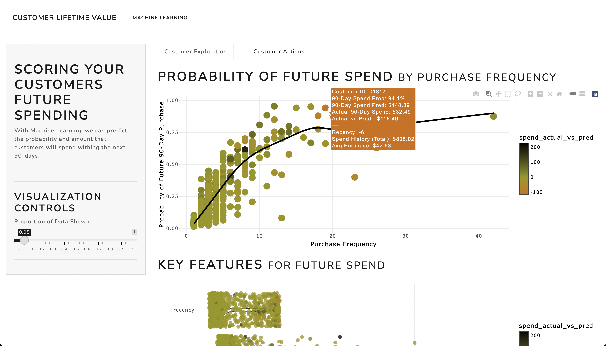
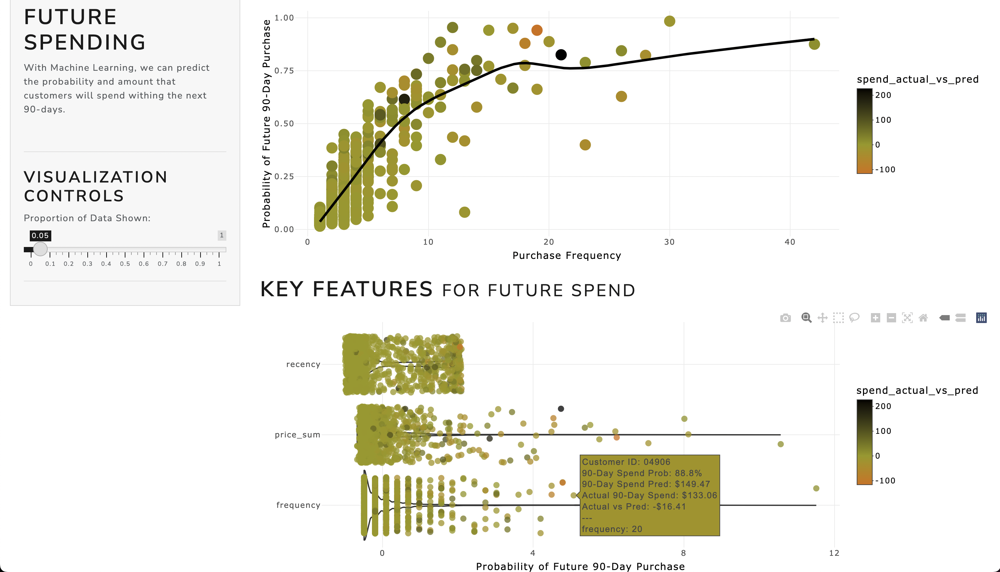
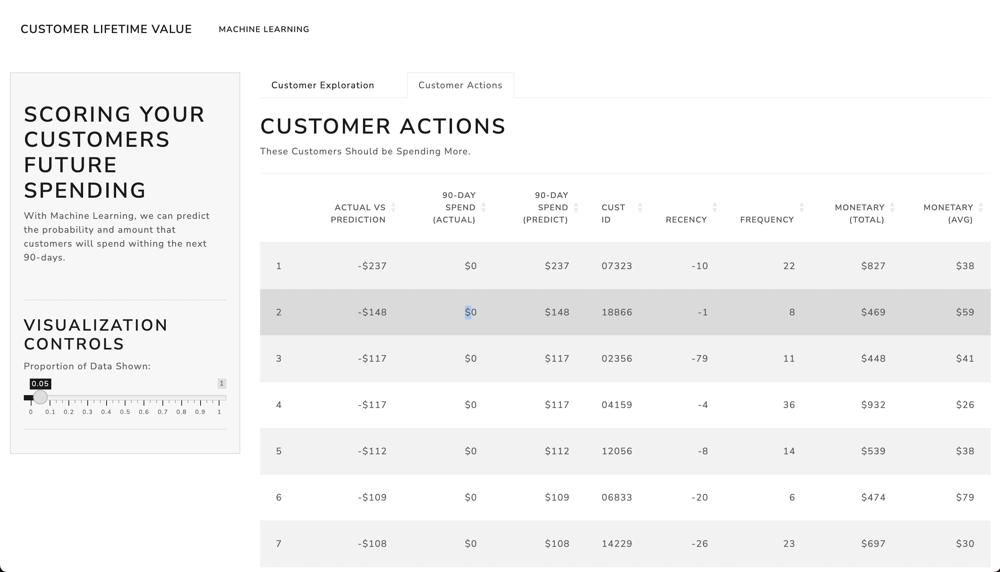

# Customer Lifetime Value

Customer Lifetime Value (CLV) is a crucial metric for businesses, as it represents the total revenue a company can expect to generate from a single customer over their entire relationship. Calculating and understanding CLV can help businesses make informed decisions on customer acquisition, retention, and marketing strategies.

In this small learning project, we will create an interactive R Shiny dashboard to estimate and visualize the Customer Lifetime Value for a given dataset of customer transactions. We will assume that we have a dataset containing historical transactional data, including customer IDs, transaction dates, and transaction amounts.

### Output

